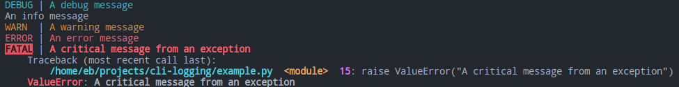
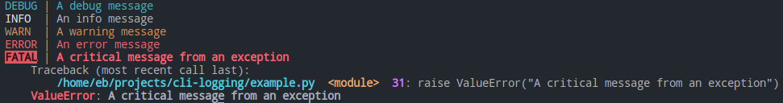

# Pretty Log

A collection of logging utilities to prettify logs in Python applications.

## Usage

The most basic usage:

```py
from pretty_log import setup
setup()
```

This will print pretty messages to the console, and does not log to a file.

By default, the console will log at INFO level.

You can also use the context manager (recommended):

```py
from pretty_log import logging_context

with logging_context():
    ...
```

## Recipes

### Logging to a file

```py
import logging
from pretty_log import (
    logging_context,
    create_file_handler,
    create_console_handler,
)


if __name__ == "__main__":

    with logging_context(
        console_handler=create_console_handler(level=logging.DEBUG),
        extra_handlers=[create_file_handler("test.log")],
    ):
        try:
            logging.debug("A debug message")
            logging.info("An info message")
            logging.warning("A warning message")
            logging.error("An error message")
            raise ValueError("A critical message from an exception")
        except Exception as exc:
            # adding exc_info=True should not be done in production!
            logging.critical(str(exc), exc_info=True)
```

This will print the following in the console:



And write output in `test.log`:

```log
WARNING:2022-06-14 17:59:51,794:root:A warning message
ERROR:2022-06-14 17:59:51,794:root:An error message
CRITICAL:2022-06-14 17:59:51,794:root:A critical message from an exception
    Traceback (most recent call last):
        /home/eb/projects/cli-logging/example.py  <module>  20: raise ValueError("A critical message from an exception")
    ValueError: A critical message from an exception
```

### Change the format of a specific level

You can pass a custom formatter to `create_console_formatter` which contains an overridden format for a specific log level:

```py
import logging
from pretty_log import (
    cli_logging_context,
    create_file_handler,
    create_console_handler,
    MultiFormatter,
    DEFAULT_FORMATS,
    style,
)


if __name__ == "__main__":

    my_formats = {
        **DEFAULT_FORMATS,
        logging.INFO: style("INFO ", fg="white") + " | %(message)s",
    }

    with logging_context(
        console_handler=create_console_handler(
            level=logging.DEBUG,
            formatter=MultiFormatter(formats=my_formats),
        ),
        extra_handlers=[create_file_handler("test.log")],
    ):
        try:
            logging.debug("A debug message")
            logging.info("An info message")
            logging.warning("A warning message")
            logging.error("An error message")
            raise ValueError("A critical message from an exception")
        except Exception as exc:
            logging.critical(str(exc), exc_info=True)

```



### Use a custom file handler for file rotation

Creating your own handler is simple:

```py
import logging
from pretty_log import PrettyExceptionFormatter

formatter = formatter or PrettyExceptionFormatter(
    "%(levelname)s:%(asctime)s:%(name)s:%(message)s", color=False
)
# rotate the file every day
file_handler = logging.handlers.TimedRotatingFileHandler(path, when="D")
file_handler.setFormatter(formatter)
file_handler.setLevel(level)

return file_handler
```

Then, use the custom handler:

```py
with logging_context(extra_handlers=[file_handler]):
    ...
```

### Configure logging permanently

The logging context is a context manager, so just call its `__enter__` method:

```py
logging_context(...).__enter__()
```

This can be useful for setting up the logging inside a `click` main function, for example.
